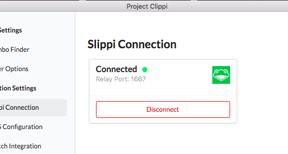

# Connecting to a Slippi Relay

This tutorial assumes that you have Slippi mirroring already set up. If you have not set up Slippi mirroring, follow [the Slippi mirroring guide](https://docs.google.com/document/d/1ezavBjqVGbVO8aqSa5EHfq7ZflrTCvezRYjOf51MOWg/edit) first before following the steps below.

## 1. Setup Slippi Desktop App

Make sure you have the [Slippi Desktop app](https://slippi.gg/downloads) installed.

At the main screen, click on "Stream from Console".

Next click, "Edit".

Switch to the "Advanced" tab, then enable "Wii Relay".

You should now see "Relay Port" section next to your Wii connection. Remember this number since it will be important for later.

> **Notice to Mac and Linux users**: If you use Mac or Linux, the relay port number *must* be strictly greater than 1024 or you will need root. To the best of my knowledge the latest public version of the Slippi Desktop app for Mac and Linux still use ports which are <= 1024. If the relay port is indeed less than 1024, either try running the Slippi Desktop app as root, or manually [build the latest version](https://github.com/project-slippi/slippi-desktop-app/) of the Slippi Desktop app for your own platform.

## 2. Setup Project Clippi

Make sure you have the latest version of Project Clippi from [the releases page](https://github.com/vinceau/project-clippi/releases).

Open up the settings page and click "Slippi Connection".

In the left hand panel, where it says "Connect to Slippi Relay", enter the number you saw before for the Relay Port. Click "Connect".

It should now say "Connected" and display the port underneath.

## 3. Success!

You should now be ready to start customising different events and actions. Close the settings page and start automating!